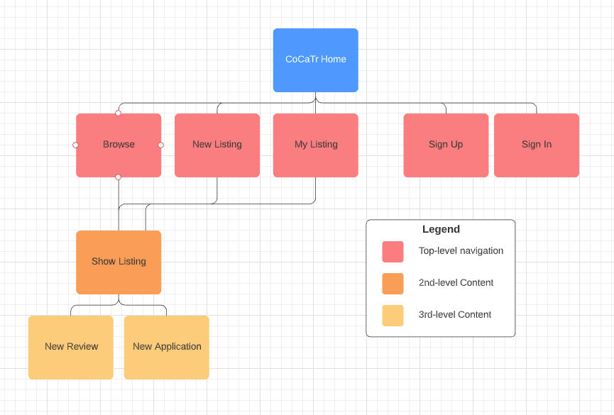

# T2A2 - 2 Sided Marketplace
## Harley Martin-Farrell

### Why CoCaTr?

CoCaTr was created in response to the way the gaming community has been splintered into small shards by the rise of discord servers and aims to provide a hub for players to help each other out, advertise their coaching services, and even arrange trades that span multiple games.

Another issue CoCaTr aims to address is the leap of faith people must make when purchasing an item or service from a random user in a chat room, with a system of user reviews, as well as a report system so that bad-faith users can be caught promptly.

### Links

[cocatr - live version](https://cocatr-deployment.herokuapp.com/)

[github](https://github.com/harley-ca/T2A2-RailsMarketplace)

## Purpose

The mission statement of CoCaTr is to provide a safe, multi-game marketplace for users to arrange goods or service exchanges. What that means to us is a marketplace where you can feel confident arranging a trade with someone that they won’t scam you, because you can see proof of their past transactions and read reviews on their conduct, as well as a report function so that inappropriate content can be dealt with swiftly.

## Features

A responsive listing board where you can browse listings and search for specific listings by title.
Easy-to-use application system to register your interest in a listing.
My Listings page to view listings you’ve posted, with indications for which listings need attention.

## Sitemap

## Screenshots

## Target Audience

The core target audience for CoCaTr are young adults interested in a range of video games, as opposed to being dedicated to one in particular. This is because while CoCaTr can provide something for those people, it is likely they are already heavily involved in their games' specific community space.

## Tech stack

Ruby on Rails - CoCaTr is built entirely in Rails, utilising a number of built-in features as well as a series of third party gems to expand it’s capabilities.

HTML - The view for CoCaTr are written in html.erb, which allows Ruby code to interact with the HTML, enabling the card based system for viewing listing and applications.

CSS/SASS - While not customised extensively, this project utilises SASS to provide styling for the front end.

Bootstrap - Loaded as a gem inside of Rails, Bootstrap was used as the main styling tool for this application.

Heroku - CoCaTr is deployed on Heroku, as suggested for beginner Rails projects.

PostgreSQL - This application uses a PostgreSQL relational database, as is that was one of the requirements of this assessment.

Cloudinary - Cloudinary provides cloud image hosting for CoCaTr through their free service.

Devise - The Devise gem for Rails was used to scaffold the User model, which was then modified for CoCaTr’s specific purposes.

Pg_search - This gem provides a new type of scope which was utilised to create the search bar functionality.

Simple_form - Another gem, Simple_form provides an easier way to write forms in Rails and was used for all forms on CoCaTr.

Enum_help - This gem provides extra functionality to enums, and is used to simplify how the Status and Application_type attributes are handled.

## Wireframes

[wireframes pdf](/docs/CoCaTr_Wireframes.pdf)

[wireframes images](/docs/wireframe_images/)

## Entity Relationship Diagram

## Different high level components

CoCaTr is developed using Ruby on Rails, which is a full-stack framework and provides many tools, services and software that form the foundation that CoCaTr was built on. 

At the heart of Rails is the Model-view-controller (MVC) structure which splits different functions of the application up into more manageable components, each handling a different aspect of the application. A key feature included in Rails is its inherited classes for each of these components, such as Application Record or Application Controller which provide a basic functionality to each new model or controller created within Rails. 

## Third Party Services

#### Heroku

The go-to hosting site for Rails projects, Heroku was an obvious choice for deployment of CoCaTr, which was easy to do via command line and free. Due to the project being buried inside the main repository for this project, CoCaTr is deployed from a subtree branch of the main T2A2 repository.

#### Cloudinary

Another free option, Cloudinary is a common choice for small-scale projects needing cloud hosting, and also provides a built-in service that could be used to automatically crop and resize images show in the app in the future.

#### Bootstrap

Due to the time constraints surrounding the early development of CoCaTr, I opted to utilise Bootstrap’s third party library to more easily style the site for early deployment.

## Models and their relationships

CoCaTr utilises only four models for its core functionality, which are the following:

#### Users

The user model for CoCaTr was created using Devise, and as such underwent comparatively little configuration during development. In an effort to simplify the structure of CoCaTr, Users are the highest level model inside the application, with each other model representing a type of post belonging to the user. Due to this, the associations for the User model are as follows.

User has many Listings
User has many Applications
User has many Reviews

#### Listings

Listings are the main “product” for CoCaTr, and as such are the main source of interaction between the other Models. As a core function of the application, they must be able to receive applications and reviews from other users. Additionally, Listings are currently the only model with the capability of being associated with images. The associations for the Listings are as follows:

Listings belongs to User
Listing has many Applications
Listing has many Reviews
Listing has one attached Listing Picture

#### Applications

The application model is used for two distinct purposes, as applications which must be shown to the owner of a listing, as well as a report viewable by administrators. Despite their differences, the basic premise of a text post sent by a user to a listing was similar enough that they were condensed into one model. The associations for the Application model are as follows:

Applications belong to User
Applications belong to Listing

#### Reviews

While similar to Applications, Reviews require slightly different attributes and more importantly, should only be able to be created by Users with Applications attached to the Listing. Due to this, they were created as their own model with the following associations:

Reviews belong to User
Reviews belong to Listing

## Database Relations

CoCaTr was designed from the ground up to utilise simplistic data relations for greater effect, and as such I was able to develop the project with a maximum of two foreign keys in any one model. This limitation still allows all the relevant data to be accessed where needed, but enforces a level of consistency across all data access within the app.

#### Users

Due to Users being the highest level model, the Users table requires only a single column devoted to User_ID which is its primary key. This key is referenced in every manually created table except for Active Storage, as all other Models will belong to a User.

#### LIstings

Listings act as a standalone post owned by a user, to which other users respond to using applications and reviews. Thanks to this, Listings require only their primary key in the form of a Listing_ID, as well as a foreign key User, which is used to store the User_ID user who created the post.

#### Applications & Reviews

While belonging to different Models, Applications and Reviews function largely the same way in regards to their database relations, containing one primary key and two foreign keys each. While the primary keys differ, as they refer to their table names respectively (Application_ID and Review_ID), their foreign key columns are identical, containing the Users column for their respective owners User_ID, as well as a Listings column to relate them the specific listing they were posted in response to.

## Database Schema Design

“Provide your schema.rb and discuss how it compares to the ERD you provided”

## Project Management

[trello (includes user stories)](https://trello.com/b/buCLH71m/term-2-marketplace-app)

